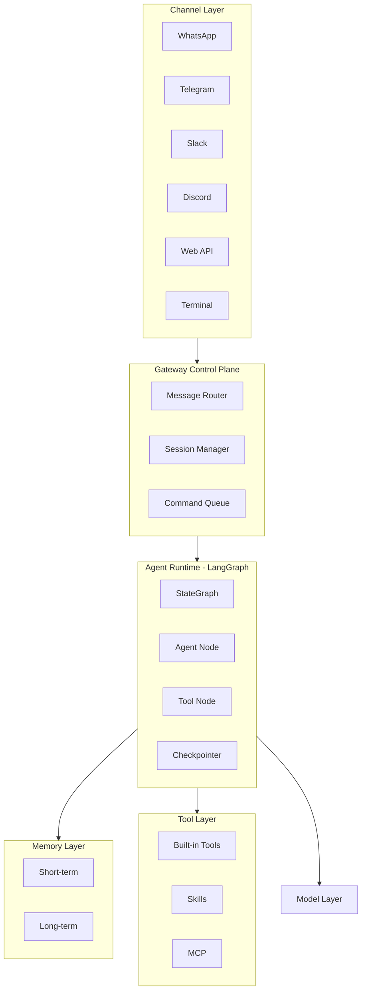

# OpenCLaw-LangGraph Full Parity Implementation Plan

## Architecture Overview



---

## Phase 1: Core Agent Runtime (LangGraph)

**Goal:** ReAct agent loop with tools, state, and persistence.

### 1.1 LangGraph Agent Graph

- **StateGraph** with typed state: `messages`, `session_id`, `metadata`
- **Nodes:** `agent` (LLM + tool binding) → `tools` (ToolNode) → `agent` (conditional loop)
- **Conditional edges:** `should_continue` routes based on `tool_calls`
- **Checkpointer:** `PostgresSaver` for short-term conversation persistence (configurable to `InMemorySaver`/SQLite)
- **References:** [langgraph/graph_tools.py](langgraph/graph_tools.py), [langchain/mcp_agent.py](langchain/mcp_agent.py) (`create_react_agent`)

### 1.2 Model Abstraction

- **Provider registry:** OpenAI, Anthropic, Google (Gemini), Ollama (local)
- **Config-driven:** `model: openai/gpt-4o`, `anthropic/claude-sonnet`, `ollama/llama3`
- Enforce context limits and compaction reserve per provider

### 1.3 Tool Registry & Skills

- **Built-in tools:** web_search, calculator, file_read, file_write, shell (sandboxed), email, calendar, etc.
- **Skill loader:** Load `SKILL.md` folders (name, description, instructions) and inject into context
- **MCP integration:** Load tools from MCP servers (stdio, SSE)
- **Tool count target:** 5700+ via Skills catalog + MCP (mirror OpenCLaw scope)

---

## Phase 2: Memory Layer

### 2.1 Short-Term Memory

- **LangGraph Checkpointer:** `PostgresSaver`, `SqliteSaver`, `InMemorySaver`
- **Context assembly:** System prompt + bootstrap files + skills prompt + message history
- **Compaction:** Truncate/prune when approaching context limit; configurable `max_turns`, TTL

### 2.2 Long-Term Memory

- **LangGraph Store:** `InMemoryStore`, `PostgresStore`, or custom backend (Redis)
- **Semantic search:** Vector embeddings for retrieval-augmented context
- **Memory flush/pruning:** `compaction.mode: "archive"`, configurable retention

---

## Phase 3: Gateway Control Plane

### 3.1 Gateway Service

- **Process:** Long-lived WebSocket server (default `ws://127.0.0.1:18789`)
- **Responsibilities:** Routing, session management, health checks, access control
- **Tech:** FastAPI + WebSockets, or `websockets` library

### 3.2 Message Routing

- **Normalized message schema:** `sender`, `body`, `attachments`, `channel_id`, `metadata`
- **Multi-agent routing:** Route by channel, contact, or group (config-driven)
- **Command Queue:** Serialize per-session to prevent tool conflicts

### 3.3 Session Management

- **Session ID** per conversation; state tied to `thread_id` in LangGraph
- **Lifecycle:** Created → Initializing → Running → Paused → Stopped

---

## Phase 4: Channel Layer

### 4.1 Channel Adapter Interface

- **Abstract base:** `ChannelAdapter` with `connect()`, `send()`, `receive()`, `normalize_message()`
- **Output:** Unified `NormalizedMessage` for Gateway

### 4.2 Channel Implementations (50+ Target)

| Priority | Channels                     | Libraries/APIs                         |
| -------- | ---------------------------- | -------------------------------------- |
| P0       | Terminal, Web API, WebSocket | stdio, FastAPI                         |
| P1       | Slack, Discord, Telegram     | slack-sdk, discord.py, grammY/Telethon |
| P1       | WhatsApp                     | Baileys / whatsapp-web.js              |
| P2       | Signal, iMessage, Teams      | signal-cli, bluebubbles, msgraph       |
| P2       | Email, SMS                   | aiosmtplib, twilio                     |
| P3       | Remaining 40+                | Per-channel adapter                    |

- **Access policies:** `pairing`, `allowlist`, `open`, `disabled` for DMs and groups

---

## Phase 5: Proactive & Event-Driven

### 5.1 Triggers

- **Heartbeats:** Periodic pings (e.g., 30 min) to keep agent “awake”
- **Cron jobs:** Scheduled tasks via cron expressions
- **Webhooks:** HTTP endpoints for external events
- **Hooks:** Internal triggers (e.g., file change, agent-to-agent)

### 5.2 Integration with LangGraph

- **Interrupts:** Human-in-the-loop for approvals
- **Async invoke:** Non-blocking runs for scheduled/webhook triggers
- **Thread isolation:** Separate `thread_id` per trigger source

---

## Phase 6: Configuration & Multi-Agent

### 6.1 YAML Configuration

```yaml
agents:
  support-bot:
    model: anthropic/claude-sonnet-4.6
    system_prompt: "You are a support assistant."
    channels: [slack, email]
    memory:
      backend: postgres
      long_term: redis
    tools: [web_search, calculator, ticket-creation]
    skills: [knowledge-base]
    max_turns: 50
    temperature: 0.7
  code-reviewer:
    model: openai/gpt-4o
    channels: [github]
    skills: [code-review, linting]
```

### 6.2 Multi-Agent Orchestration

- **Per-agent graphs:** Each agent = separate compiled StateGraph with own checkpointer/store
- **CLI:** `openclaw start <agent>`, `openclaw start --all`, `openclaw status`

---

## Phase 7: Production Readiness

### 7.1 Observability

- **Logging:** Structured logs for Gateway, runtime, channels
- **LangSmith:** Optional integration for traces and debugging

### 7.2 Resilience

- **Crash recovery:** Resume from last checkpoint
- **Rate limiting:** For embeddings, external APIs
- **Health endpoints:** `/health`, `/ready` for Gateway

---

## Project Structure (Proposed)

```
projects/openclaw-langgraph/
├── pyproject.toml
├── config.yaml / openclaw.yaml
├── src/
│   ├── gateway/
│   │   ├── server.py          # WebSocket / HTTP server
│   │   ├── router.py
│   │   └── session.py
│   ├── channels/
│   │   ├── base.py            # ChannelAdapter ABC
│   │   ├── terminal.py
│   │   ├── web.py
│   │   ├── slack.py
│   │   ├── discord.py
│   │   ├── telegram.py
│   │   └── ...
│   ├── runtime/
│   │   ├── graph.py           # LangGraph StateGraph
│   │   ├── agent.py           # Agent node, tool binding
│   │   └── context.py         # Context assembly
│   ├── memory/
│   │   ├── short_term.py      # Checkpointer wrappers
│   │   └── long_term.py       # Store, embeddings
│   ├── tools/
│   │   ├── registry.py
│   │   ├── builtin/
│   │   └── skills.py          # SKILL.md loader
│   ├── models/
│   │   └── providers.py       # OpenAI, Anthropic, Ollama...
│   ├── triggers/
│   │   ├── cron.py
│   │   ├── webhook.py
│   │   └── heartbeat.py
│   └── config/
│       └── loader.py
└── skills/                    # Skill directories with SKILL.md
```

---

## Dependencies

- **langgraph**, **langgraph-checkpoint**, **langgraph-prebuilt**
- **langchain**, **langchain-openai**, **langchain-anthropic**, **langchain-google-genai**
- **langchain-mcp-adapters** (MCP tools)
- **fastapi**, **uvicorn**, **websockets**
- **pyyaml**, **pydantic**
- Per-channel: `slack-sdk`, `discord.py`, `telethon`/`grammY`, etc.

---

## Implementation Order (Suggested)

| Phase | Deliverable                                                 | Est. Effort |
| ----- | ----------------------------------------------------------- | ----------- |
| 1     | Core ReAct agent + tools + checkpointer                     | 1–2 weeks   |
| 2     | Memory (short + long-term, embeddings)                      | 1 week      |
| 3     | Gateway + routing + sessions                                | 1–2 weeks   |
| 4     | Channels: Terminal, Web, Slack, Discord, Telegram, WhatsApp | 2–3 weeks   |
| 5     | Proactive: cron, webhooks, heartbeats                       | 1 week      |
| 6     | YAML config + multi-agent + CLI                             | 1 week      |
| 7     | 40+ additional channels + 5700+ tools (Skills + MCP)        | 2–4 weeks   |
| 8     | Observability, resilience, polish                           | 1 week      |

**Total:** ~10–14 weeks for full parity.

---

## Key Design Decisions

1. **LangGraph as single agent runtime:** All reasoning and tool use go through a compiled `StateGraph`; Gateway only orchestrates.
2. **Gateway stateless for routing:** Session state lives in checkpointer/store; Gateway holds routing tables and queues.
3. **Skills as first-class:** Each skill = folder with `SKILL.md`; loaded into context assembly, not as separate graphs.
4. **Channel adapters as plugins:** Implement `ChannelAdapter`; register in config; Gateway discovers and connects.
